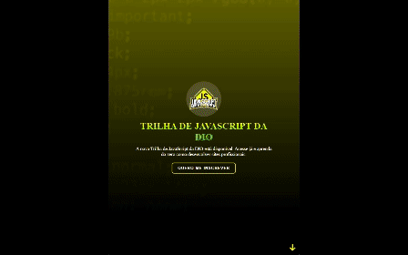

<h1 align="center"> Desafio 01: Criando sua primeira Landing Page com HTML e CSS </h1>

  <a href="#descrição-do-projeto">Descrição do Projeto</a>&nbsp;&nbsp;&nbsp;|&nbsp;&nbsp;&nbsp;
  <a href="#layout">Layout</a>&nbsp;&nbsp;&nbsp;|&nbsp;&nbsp;&nbsp;
  <a href="#tecnologias-utilizadas">Tecnologias Utilizadas</a>&nbsp;&nbsp;&nbsp;|&nbsp;&nbsp;&nbsp;
  <a href="#licença">Licença</a>&nbsp;&nbsp;&nbsp;|&nbsp;&nbsp;&nbsp;
  <a href="#autor">Autor</a>

  

  
  
  

 

  

## Descrição do Projeto

Este projeto consiste em uma página web interativa desenvolvida para a Digital Innovation One (DIO) como parte da trilha de aprendizado de CSS. A trilha tem como objetivo ensinar do básico ao avançado sobre o uso de HTML,CSS e JavaScript para a criação de sites profissionais, sem a necessidade de bibliotecas ou frameworks adicionais.

Usei o HTML para estruturar o conteúdo da página, definindo elementos como cabeçalho, seções, imagens e links.

O CSS foi utilizado para estilo e aparência da página. Foram aplicados estilos customizados, como esquemas de cores, fontes, efeitos de transição e posicionamento de elementos.

E o JavaScript adicionar interatividade à página. O código em JavaScript controla o comportamento dos botões de navegação e proporciona uma experiência suave de rolagem.

- [Clique aqui](https://github.com/digitalinnovationone/trilha-css-desafio-01) para acessar o repositorio do desafio original.

## Layout

- [Clique aqui](https://micheleambrosio.github.io/dio-trilha-css-desafio-01/) para acessar a Landing Page criada pela dio que usei como base para o desafio!

- [Link do Figma](https://www.figma.com/file/3PiokoJj9IhGDnNiWAJbz7/DIO---Desafio-01?node-id=2%3A6) contendo o protótipo do desafio para
  que você possa se basear

## Tecnologias Utilizadas

- **Linguagens:** HTML, CSS e JavaScript
- **Controle de Versão:** Git
- **Design e Prototipagem:** Figma
- **IDE:** Visual Studio Code
- **Hospedagem do Código:** GitHub

## Licença

Este projeto está sob a . Consulte o arquivo [LICENSE](./LICENSE) para obter mais detalhes.

## Autor

Feito com ❤️ por Lucelho Silva. [Entre em contato !](https://www.linkedin.com/in/lucelho-silva-b17196239/)
